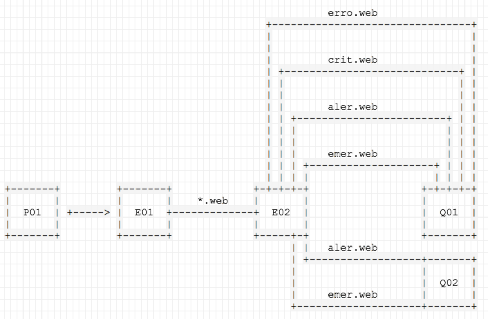
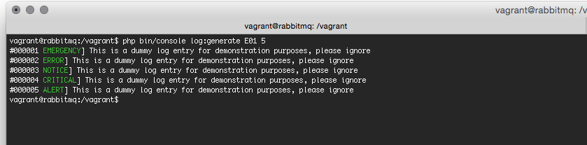

#rabbitmq.demo.phpne.org.uk

####Message Flow



####Usage

```
vagrant up
vagrant ssh
composer install
php bin/console log:generate
```



You can access the RabbitMQ Management UI via http://127.0.0.1:15672 using the guest/guest credentials.

####Files Of Interest

- env/puppet/modules/rabbitmq/manifests/init.pp (RabbitMQ Installation)
- env/puppet/modules/app/manifests/init.pp (RabbitMQ Application Configuration)
